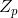
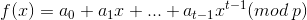
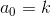
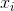
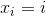
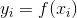
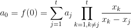

# Shamir's Secret Sharing

## Table of contents

* [Technologies](#technologies)
* [High-level explanation](#high-level-explanation)
* [Theory](#theory)

## Technologies

- **Java 11**
- **Lombok**

## High-level explanation

Shamir's Secret Sharing is used to secure a secret in a distributed way, most often to secure other encryption keys.
The secret is split into multiple parts, called shares.
These shares are used to reconstruct the original secret.

To unlock the secret via Shamir's secret sharing, you need a minimum number of shares.
This is called the threshold, and is used to denote the minimum number of shares needed to unlock the secret.
Let us walk through an example:

> Problem: Company XYZ needs to secure their vault's passcode. 
They could use something standard, such as AES, but what if the holder of the key is unavailable or dies?
What if the key is compromised via a malicious hacker or the holder of the key turns rogue, and uses their power over the vault to their benefit?

This is where SSS comes in.
It can be used to encrypt the vault's passcode and generate a certain number of shares, where a certain number of shares can be allocated to each executive within Company XYZ.
Now, only if they pool their shares can they unlock the vault.
The threshold can be appropriately set for the number of executives, so the vault is always able to be accessed by the authorized individuals.
Should a share or two fall into the wrong hands, they couldn't open the passcode unless the other executives cooperated.

## Theory
The essential idea of Adi Shamir's threshold scheme is that 2 points are sufficient to define a line, 3 points are sufficient to define a parabola, 4 points to define a cubic curve and so forth.
That is, it takes `t` points to define a polynomial of degree `t-1`.

Suppose we want to use a `(t,n)`- threshold scheme to share our secret `k` that is an element in a finite field  where `p` is a prime number.

Dealer builds a random polynomial  in , and let .
Dealer chooses random  for example  and computes .
Every participant is given a point (a pair of input to the polynomial  and output).
Given any subset of `t` of these pairs, we can find the coefficients of the polynomial.

The secret  can be reconstructed as follows:

